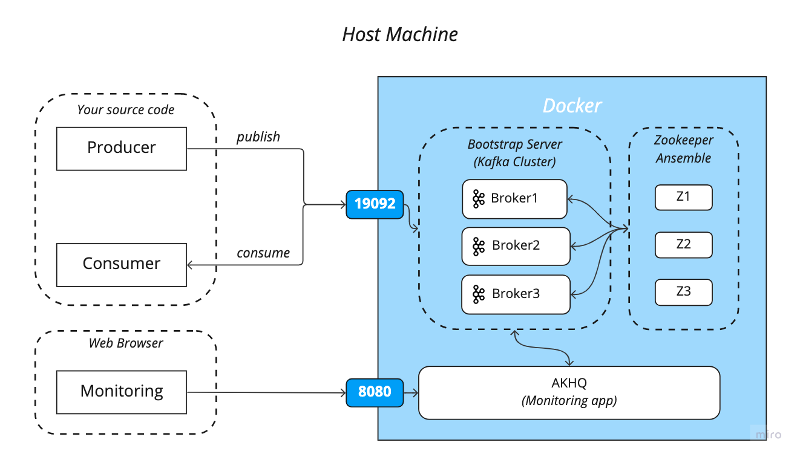

# Docker Environment

Docker-based architecture is as follows:

<p text-align="center">
  
</p>


```shell
docker-compose -f <target-file> up [-d]
```
* Target file

    You should execute the commands below in `docker/` directory. Otherwise, volume files are created in project root directory.
    * `kafka-single.yml`
  
        This is for single kafka broker and single zookeeper environment.
        ```shell
      $ pwd # <your path>/iitp_infra/docker
      $ docker-compose -f kafka-single.yml up
        ```

    * `kafka-cluster.yml`
    
        This is for kafka basic cluster environment with 3 broker and 3 zookeepers.
      ```shell
      $ docker-compose -f kafka-cluster.yml up
        ```

    * `docker/kafka-monitoring.yml`_**(2023.01.20 updated)**_
    
        This is for kafka single broker with ELK monitoring system.
      ```shell
      $ docker-compose -f kafka-monitoring.yml up
        ```
* Basic commands
    
    This section is for basic commands to control docker based environment. You can also use them in GUI environment with [Docker Desktop](https://www.docker.com/products/docker-desktop/).
  * Stop containers
     ```shell
    $ docker-compose -f <target-file> stop
    ```
  * Remove containers
     ```shell
    $ docker-compose -f <target-file> down
    ```
  * Remove container volume
     ```shell
    $ docker volume prune -y
    ```

### Error Handling
If the cluster setting is not working, it might be due to those two reasons.
1. Authentication problem for volume directory.
    
    I recommend you to remove shared volume file and try it again.
    ```shell
   $ rm -rf kafka docker/zookeeper
   $ docker volume prune
   $ docker-compose -f <traget-file> up
   ```
   Otherwise, you need to change authentication in file by using `chmod` linux commands
   ```shell
   $ sudo chmod u+w docker/
    ```
   
2. Docker resources problems.
        
    You should increase the CPU and memory resources that docker can use in Docker Desktop. You can modify the limitation in Docker **_Desktop > Preferences > Resources_**.
