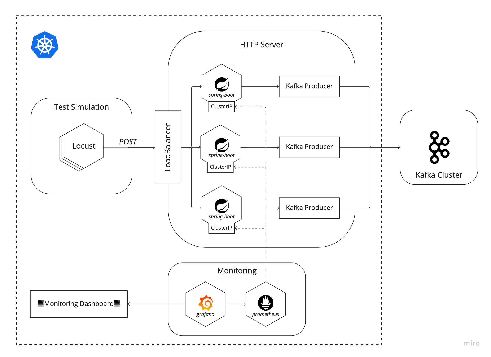
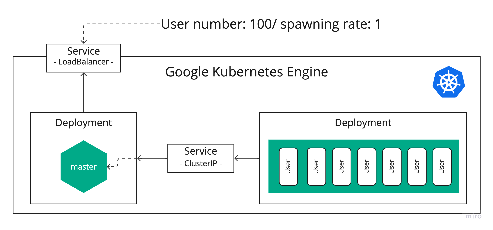

# Kubernetest Environment

Kubernetes-based architecture is as follows:



## Test simulation

* Test simulation is based on [Locust](https://locust.io/) which is load testing framework.
* Because Locust supports cluster-based environment, it ise **possible** to implement large-scale traffic environment.
* With one master node and multiple worker nodes, Locust `HttpUser` objects constantly request to HTTP server.



### Implement Testing Simulation Environment

1. Go to `/simulation` directory.
2. Execute `Makefile`
  
   ```shell
   # Implement a master node and a worker node.
   make all

   # Scale-up the number of worker nodes. Default value is 20.
   make scale [replicas=20]
   ```
   * To access master node, you need to wait some seconds to build 
3. Down the simulation structure.
   ```shell
   # Remove all the objects for test simulations.
   make clean
   ```

## HTTP Server


### Implementing HTTP server(Publish application)

## Monitoring

## [TODO] Stream Application

## Steps for implement kubernetes-based architecture.

1. Test simulator.
2. Publisher with HTTP server.
3. Monitoring dashboards.
