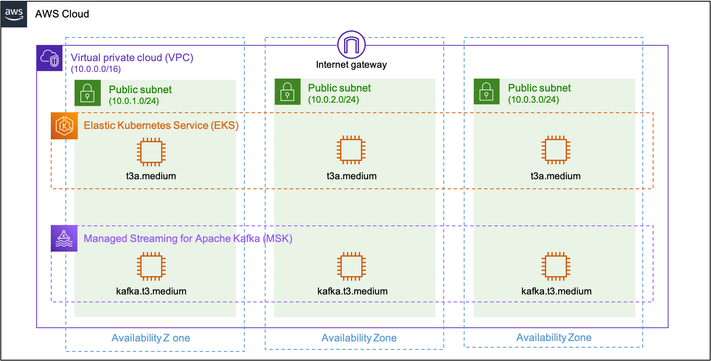
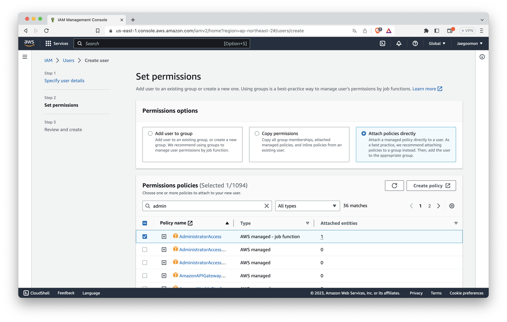

# Terraform Evironment

This directory is for setting up AWS infrastructure. 
AWS based architecture is as follows:

<p text-align="center">
  
</p>

## Setting Environment

* You must install terraform to execute terraform command.
* You can install terraform by this [link](https://developer.hashicorp.com/terraform/tutorials/aws-get-started/install-cli).

### Basic Terraform comamnd.

1. `terraform plan`: checking revision version of infrastructure. This is just for checking if there is any errors and expected outputs.
2. `terraform apply`: apply new version of infrastructure. 
3. `terraform destroy`: down the all infrastructure you already installed.

### How to connect terraform application to your cloud address?

* To use terraform command line for provisioning your own infrastructure, you need to connect your local machine with your AWS account.
* You can do it as follows:

  1. Create new IAM(AWS user managing service) user in you AWS aacount.
   
      <p text-align="center">
        
      </p>

      * For convenient, you can set policy attatchment by `AdministratorAcess`. This gives whole access control to your IAM user.
      * If you successfully create new IAM account. You will get your own *secret_key* and *access_key*.
      * Those keys are not issued again once you already achieved. So, please keep in your own directory.

  2. Connect your IAM user and your local machine.

       *  For connection, you need to install aws-cli tool.
       *  Then, you need to set configuration your aws-cli by using secret and access keys.
          ```shell
          aws configure
          # AWS Access Key ID [None]: 
          # AWS Secret Access Key [None]: 
          ```
       * Or, you can add your acess information (access_key, secret_key) to `common/provider.tf`. For securitary issue, this choice is not recommended.

## Provision Infrastructure

Whole process is executed in `common/` directory. Keep in mind that your process working directory is in `common/`.

### Initialize your tf files.

```shell
terraform init
```

* You need to initialize your infracture codes first.

### Check and provision your infrastructure.

```shell
terraform plan
terraform apply
```

* As already mentioned, `terraform plan` command is for checking if there are any errors in your terraform files.
* Actual provisioning process is done by `terraform apply`.

### \[Important\] Destroy infrastructure

```shell
terraform destroy
```

* When you finish your test or simulation process, you must destroy your infrastructure to save your usage fee.
* But, in some cases, `terraform destory` cannot remove whole with some unknowned errors. In that case, you need to remove them by yourself.
